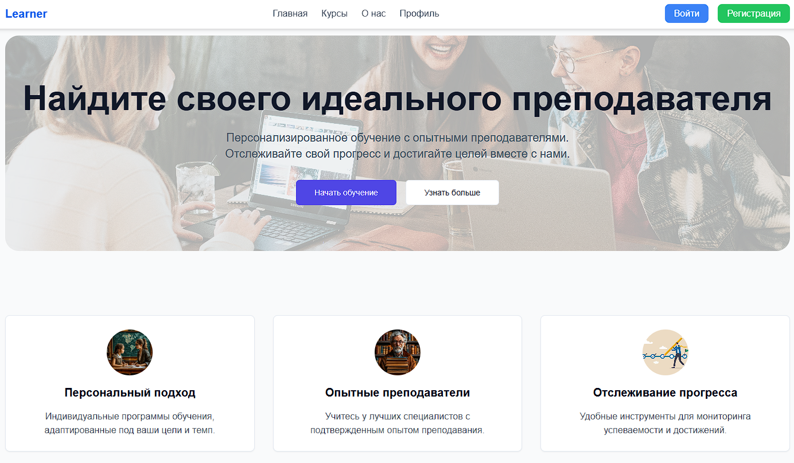
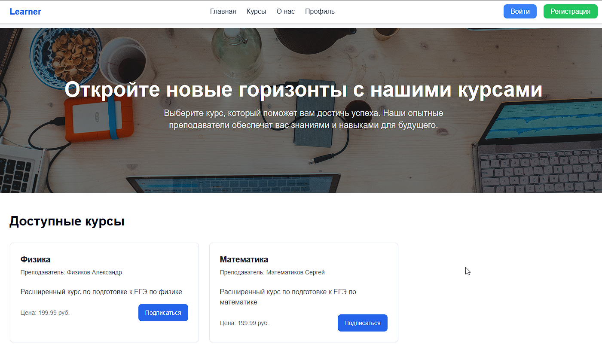
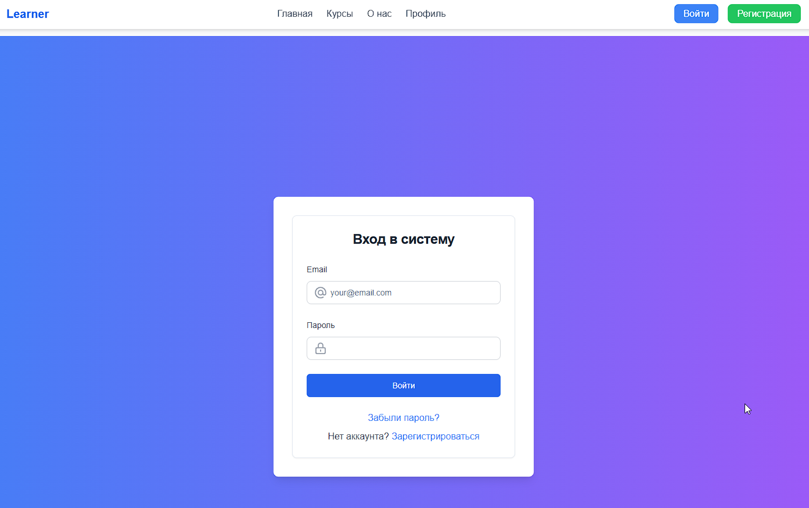
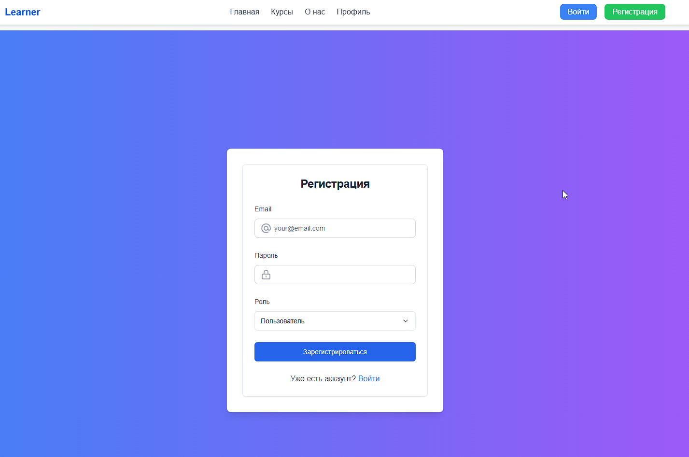
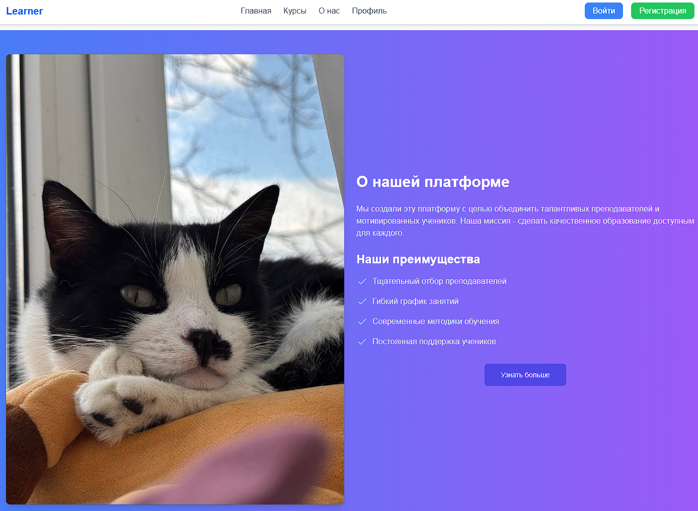
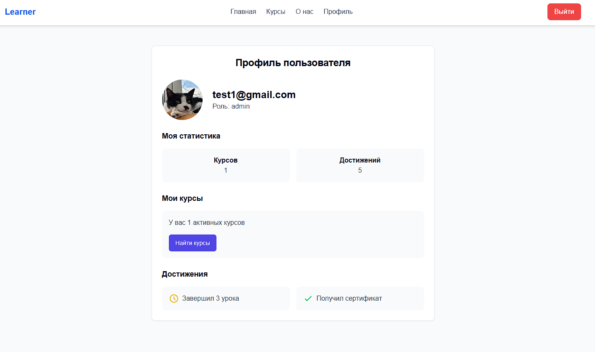

# 🎓 Учебный проект: Платформа для онлайн-курсов
Этот проект представляет собой студенческую работу по дисциплине **"Разработка веб-приложений"** в ВУЗе. Проект разработан с использованием современных технологий и инструментов для создания платформы для онлайн-курсов.

## 📌 Описание проекта
Платформа для онлайн-курсов позволяет пользователям просматривать доступные курсы, подписываться на них и управлять своим профилем. Администраторы могут добавлять новые курсы и управлять пользователями.

**Основные функции:**

- Регистрация и авторизация пользователей.

- Просмотр доступных курсов.

- Подписка на курсы.

- Добавление курсов (для администраторов).

- Управление профилем пользователя.

## 🛠️ Технологии
Проект разработан с использованием следующих технологий:

**Frontend:**
1. *React.js*— библиотека для создания пользовательского интерфейса.

2. *Tailwind CSS* — *CSS*-фреймворк для стилизации.

3. *Axios* — библиотека для выполнения *HTTP*-запросов.

**Backend:**
1. *Node.js* — среда выполнения *JavaScript* на сервере.

2. *Express.js* — фреймворк для создания *REST API*.

3. *SQLite* — база данных для хранения данных.

4. *JWT* — для аутентификации и авторизации.

## 🚀 Установка и запуск
1. Клонирование репозитория
```bash
git clone https://github.com/GinkySan/web_student_work
cd web_student_work
```
2. Установка зависимостей

```bash
npm install
```

3. Запуск приложения
*Backend:*
```bash
node src/server.js
```
*Frontend:*
```bash
npm run dev
```
Приложение будет доступно по адресу: http://localhost:8080.

📸 Скриншоты

Главная страница


Главная страница с курсами


Страница авторизации


Страница регистрации


Страница о нас


Страница профиля


## 📝 Функциональные требования
**Пользователь:**

- Регистрация и авторизация.

- Просмотр доступных курсов.

- Подписка на курсы.

**Администратор:**

- Добавление и управление курсами.

- Управление пользователями.

## 📚 Документация

Документация API — описание [REST API](https://docs.github.com/en/rest?apiVersion=2022-11-28).


## 🤝 Автор

Владелец данного git-аккаунта — Ginky_San

## 📞 Контакты
Если у вас есть вопросы или предложения, свяжитесь со мной:

*Email*: tantalus.agony@gmail.com

*Telegram*: @tantal_us